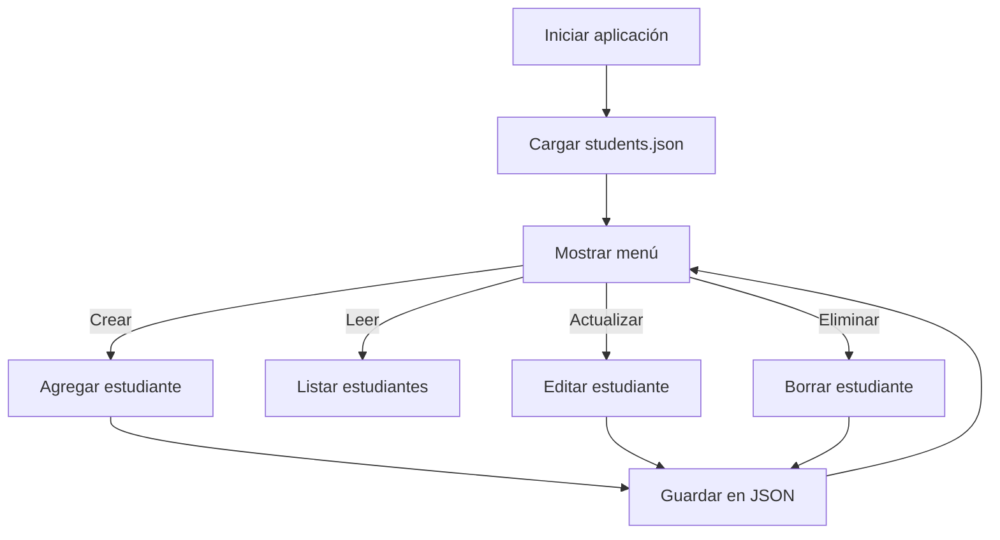

# 🎓 Student Manager App

<p align="center">
  
  
  
</p>

<p align="center">
  <b>CRUD system to manage students using Java + JSON</b><br>
  Diseño limpio · Código claro · Persistencia real
</p>

---

## 🧭 Descripción

**Student Manager App** es una aplicación de consola desarrollada en **Java** que permite gestionar estudiantes mediante operaciones **CRUD** (Crear, Leer, Actualizar y Eliminar).
Los datos se almacenan de forma persistente usando **archivos JSON**, lo que simula el comportamiento de una base de datos ligera.

---

## 🎯 Objetivo del proyecto

* Practicar **Java orientado a objetos**
* Implementar **CRUD real**
* Usar **JSON como persistencia**
* Trabajar con **Maven**
* Versionar el proyecto con **Git y GitHub**

---

## 🧩 Tecnologías usadas

| Tecnología | Uso                     |
| ---------- | ----------------------- |
| ☕ Java 11  | Lógica principal        |
| 📦 Maven   | Gestión de dependencias |
| 🧾 Gson    | Conversión Java ⇄ JSON  |
| 🗂 JSON    | Almacenamiento de datos |
| 🌱 Git     | Control de versiones    |
| ☁️ GitHub  | Repositorio remoto      |

---

## 🏗️ Arquitectura del proyecto

```text
student-manager-app
│
├── pom.xml
├── students.json
├── README.md
└── src
    └── main
        └── java
            └── com.studentmanager
                ├── Student.java
                ├── JsonStorage.java
                └── StudentManager.java
```

---

## 🔁 Flujo de funcionamiento



---

## 🧠 Componentes principales

### 📘 Student.java

Representa la entidad **Estudiante**.

```java
id | name | course
```

* Modelo de datos
* Encapsulación (getters / setters)

---

### 💾 JsonStorage.java

Responsable de:

* Leer estudiantes desde `students.json`
* Guardar cambios en el archivo JSON

```text
Java Objects ⇄ Gson ⇄ JSON File
```

---

### 🧠 StudentManager.java

* Punto de entrada del programa
* Menú interactivo por consola
* Lógica CRUD

---

## ▶️ Ejecución del proyecto

### Desde IntelliJ IDEA

1. Abrir el proyecto
2. Ejecutar `StudentManager.main()`

### Desde terminal

```bash
mvn clean compile
mvn exec:java
```

---

## 🖥️ Ejemplo de uso

```text
student manager app
1. add student
2. list students
3. update student
4. delete student
5. exit
```

---

## 🔐 Persistencia de datos

Los datos se almacenan en:

```json
[
  {
    "id": 1,
    "name": "Juan Perez",
    "course": "Java"
  }
]
```

✔ No se pierden al cerrar la aplicación

---

## 🧪 Buenas prácticas aplicadas

* Separación de responsabilidades
* Código legible y mantenible
* Estructura estándar Maven
* `.gitignore` correcto
* Commits claros

---

## 🚀 Posibles mejoras futuras

* Gestión de **cursos** como entidad
* Validaciones avanzadas
* Tests unitarios (JUnit)
* Interfaz gráfica o API REST

---

## 👤 Autor

Proyecto desarrollado como práctica de **Java Backend**.

---

<p align="center">
  <span style="color:#0A1F44"><b>Java · Maven · JSON · GitHub</b></span>
</p>
